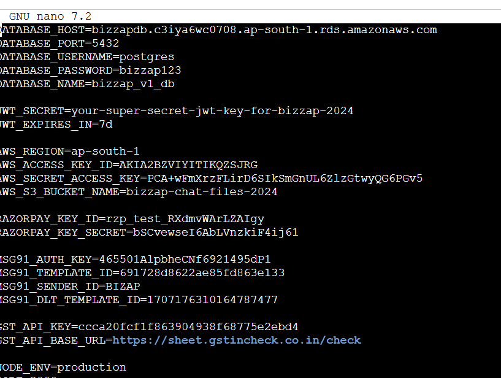

==========
deployment reference

https://claude.ai/share/41a2f43d-d741-4df0-8f28-6b4df60aa6c7

=====================
cd ~/bizzap-api
git pull origin main
npm install
npm run build
pm2 restart bizzap-api

========
nice working well, now this endpoints is from My app, your task is to write the querys to make this logs insight full,
====
 I need the analytics, the how the users spendind time in my application.
who currently in leadpage, chat page, profile page, notification screen, chat screen, ect..., aver time time the user spen on particular screen, time the user spen in app, per day, week, month, analytics based on screen(you create some)
========
in my app there are 6 screen -> lead, chat, search, notification, lead_posting, profile
==========
also current online users,  based on logs